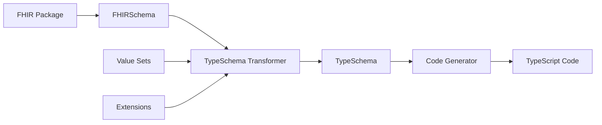

# System Architecture

## Overview

@atomic-ehr/type-schema follows a modular, two-stage architecture designed for flexibility, maintainability, and extensibility.



## Core Components

### 1. Schema Loading Layer

The schema loading layer handles FHIR package management and schema retrieval:

- **CanonicalManager**: Manages FHIR packages and resolves canonical URLs
- **FHIRSchema Translation**: Converts FHIR StructureDefinitions to simplified FHIRSchema format
- **Package Resolution**: Downloads and caches FHIR packages

### 2. TypeSchema Transformation Layer

The transformation layer converts FHIRSchema to TypeSchema format:

#### Core Modules

- **transformer.ts**: Main transformation orchestrator
- **identifier.ts**: Builds unique identifiers for types
- **field-builder.ts**: Constructs field definitions
- **binding.ts**: Processes value set bindings
- **nested-types.ts**: Handles BackboneElements

#### Key Features

- Flattens FHIR's complex inheritance model
- Resolves element snapshots through hierarchy merging
- Extracts and normalizes type information
- Generates binding schemas for constrained value sets

### 3. Code Generation Layer

The generation layer produces TypeScript code from TypeSchema:

#### Components

- **BaseGenerator**: Abstract base class for code generators
- **TypeScriptGenerator**: Concrete TypeScript implementation
- **SchemaLoader**: Loads and categorizes TypeSchema

#### Features

- Topological sorting for dependency resolution
- Modular file output (primitives, complex types, resources)
- Import management and optimization
- Type-safe code generation utilities

## Data Flow

### 1. Input Processing

```typescript
FHIR Package URL → CanonicalManager → StructureDefinition[]
                                    ↓
                              FHIRSchema[]
```

### 2. Transformation Pipeline

```typescript
FHIRSchema → TypeSchema Transformer → TypeSchema[]
                                    ↓
                            Binding Schemas[]
                                    ↓
                            Nested Types[]
```

### 3. Code Generation

```typescript
TypeSchema[] → Categorization → Generator → TypeScript Files
                              ↓
                     Dependency Analysis
                              ↓
                      Topological Sort
```

## Key Design Decisions

### Two-Stage Architecture

The separation between TypeSchema and code generation provides:

- **Language Independence**: TypeSchema can target any language
- **Easier Testing**: Each stage can be tested independently
- **Cleaner Abstractions**: Transformation logic is isolated from generation

### TypeSchema as Intermediate Format

TypeSchema simplifies FHIR's complexity:

- Flattened inheritance model
- Normalized field definitions
- Explicit dependency tracking
- Simplified binding representation

### Modular Output Structure

Generated code is organized for optimal usage:

- Separate files prevent circular dependencies
- Clear import paths improve IDE performance
- Logical grouping aids navigation

## Extension Points

The architecture supports several extension mechanisms:

### 1. Custom Generators

Create new generators by extending `BaseGenerator`:

```typescript
class MyGenerator extends BaseGenerator {
  async generate(): Promise<void> {
    // Custom generation logic
  }
}
```

### 2. Transform Plugins

Add custom transformation logic:

```typescript
interface TransformPlugin {
  beforeTransform?(schema: FHIRSchema): FHIRSchema;
  afterTransform?(typeSchema: TypeSchema): TypeSchema;
}
```

### 3. Type Mappings

Customize primitive type mappings:

```typescript
const customMappings = new Map([
  ['decimal', 'BigDecimal'],
  ['instant', 'Date']
]);
```

## Performance Considerations

### Caching

- FHIR packages are cached locally
- Resolved URLs are memoized
- Generated schemas can be persisted

### Parallel Processing

- Independent schemas are transformed concurrently
- File writes are batched for efficiency

### Memory Management

- Streaming for large packages
- Incremental processing support
- Resource cleanup after generation

## Error Handling

The system provides comprehensive error handling:

- **Schema Validation**: Ensures valid input schemas
- **Dependency Resolution**: Handles missing dependencies gracefully
- **Generation Errors**: Clear error messages with context
- **Recovery Mechanisms**: Partial generation on errors

## Future Enhancements

Planned architectural improvements:

1. **Plugin System**: Formalized plugin architecture
2. **Incremental Generation**: Only regenerate changed types
3. **Multi-Package Support**: Generate from multiple packages
4. **Custom Profiles**: Better support for profiled resources
5. **Language Targets**: Support for other languages (Python, C#, Java)